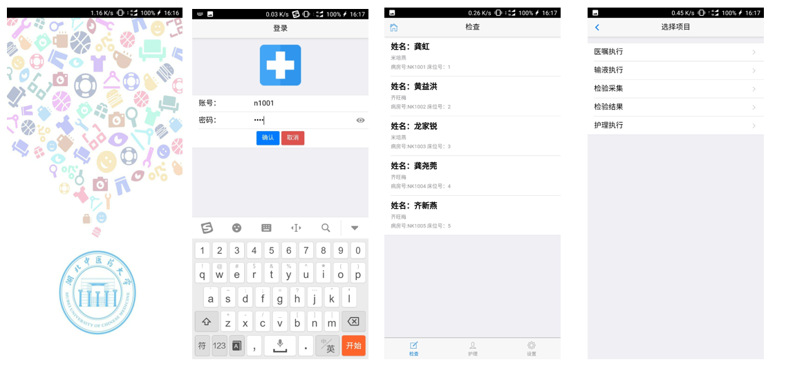
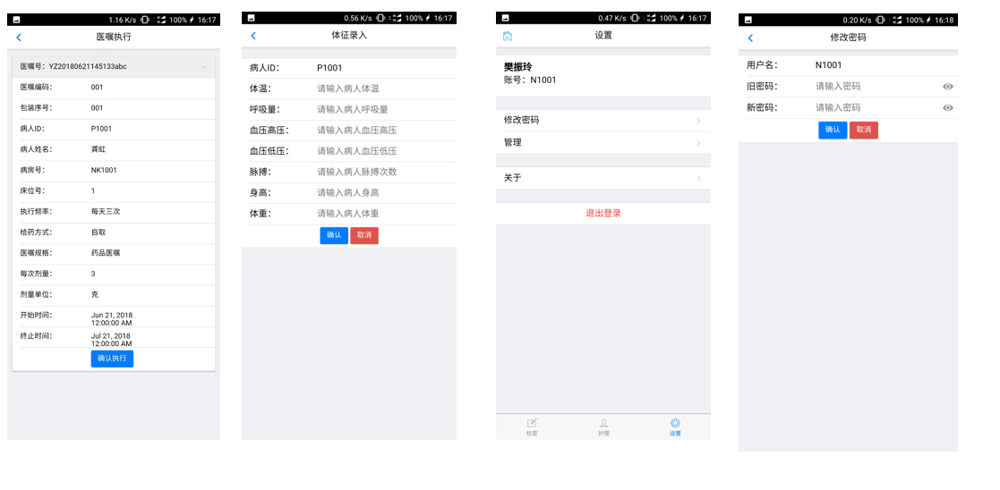
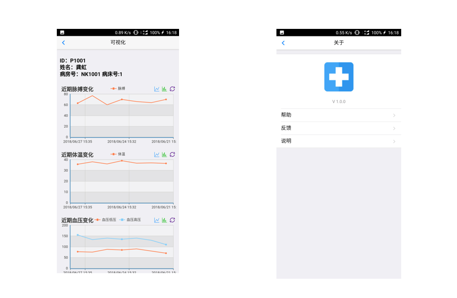

# 移动护士工作站
> Mobile Nurse Station

## 背景

> 患者在住院期间，需要每天测量生命体征数据（体温，呼吸，脉搏，血压，身高，体重，出入量等），传统做法：护士需要带着纸质记录单，测量玩手动抄录，然后去系统中进行录入，增加了护士工作量，也存在不确定性，比如忘了录入。有的医院采用较为先进的方法，通过手推车，将计算机带入病房，挨个检查，但不灵活，且存在录入设备较少，录入不方便，错过最佳录入时间段等问题。如果开发移动护理系统，护士采用移动护理app，在测量完患者后，通过手机客户端APP进行填写，及时高效，且可以多个护士同时操作，简单灵活，减少护士工作量。

## 技术：前后端分离架构 
- 前端：HTML5 + vue.js     
- 后端：spring boot + mybatis
- 客户端：安卓 webView
- 部署：静态页面用Nginx，动态服务用Tomcat，数据传输采用https(TLS)

## 功能
- 登录
- 体征录入
- 护理，医嘱，输液执行
- 检查结果查看
- 体征信息可视化
- 其他

## 业务
> - 医院护士通过登录系统，进入主页面，可以选择检查，护理和设置，选择设置可以查看个人信息，修改密码，管理病人，其中管理病人是对所管理的病人生命体征可视化，选择检查后，通过选择病人，可以对病人的体征进行录入，选择护理后，通过选择病人，可以对病人的医嘱，护理，输液等信息进行执行，对检验检查进行查看。
> - 系统采用所属管理，即护士只能管理当前分配的病人，无权管理其他病人。

## 界面
- 主功能界面

- 二级界面

- 可视化界面

